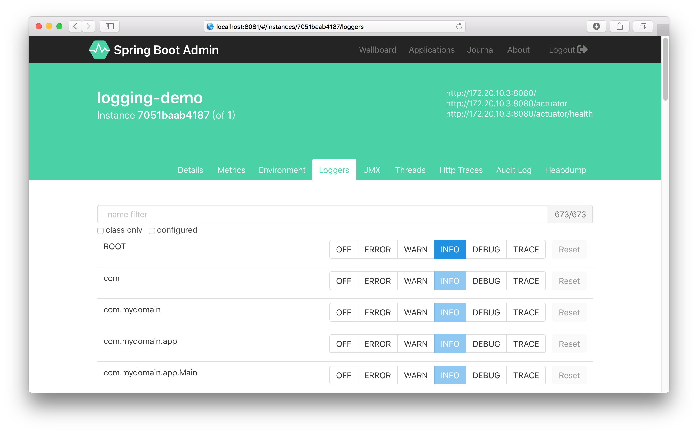
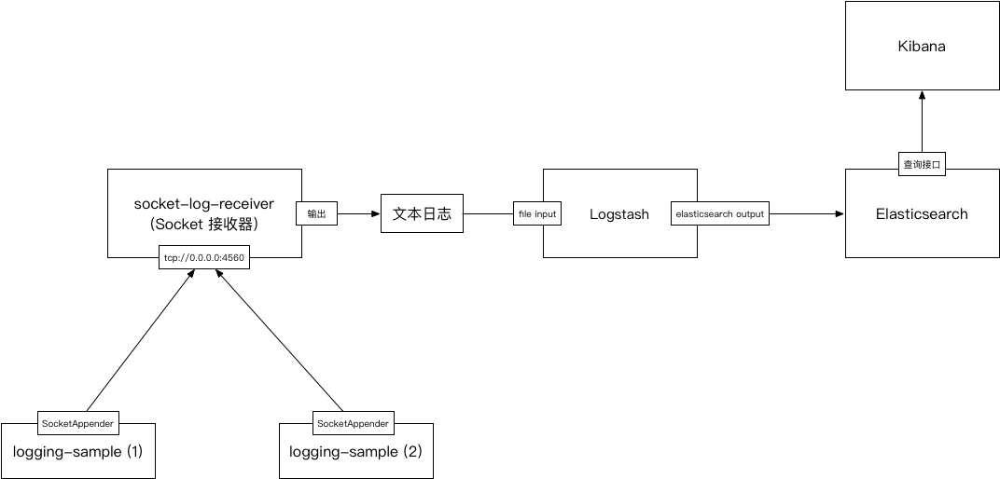

# spring-boot-logging-sample

日志记录程序运行过程中的各种事件，最常见的形式是日志文件。通用型的日志有格式规范，比如 Web 访问日志，记录客户端 IP 地址、请求时间、网页地址、HTTP 状态码、请求和响应的长度、用户代理、引用地址等等；业务日志的字段和格式就比较灵活了，需要开发者自己设计。

日志一般记录成字符文本，提供给人类阅读；还有一些日志是二进制形式，最有名的就是 MySQL 的 Binlog。

日志的作用有很多，例举以下几种：

- 最常见的作用是排查错误。程序运行的时候会发生各种错误，当排查错误的时候，数据已经被改变，现场的场景已经很难再现。日志给我们开通了一个时间机器，让我们回到故障发生的现场，查看当时的环境和数据，分析错误的原因；
- 日志是完整的数据存储，能够用来做数据分析。例如用户交互分析，预测用户未来的行为；
- 日志存储一般是大文本文件，能够达到非常高的连续读速度。我们曾经把一个数据分析任务从查数据库改成了读日志文件，运行速度提高了十几倍；
- 日志可以用来做数据一致性检查和数据同步，比如 MySQL 数据库的 Binlog；
- 日志文件也是一个额外的数据备份。我曾经经历过误删数据库的情况，备份数据库也被损坏。幸好在日志中保存了 6 个月的操作。于是我们从日志中恢复了必要的数据，快速把业务恢复起来，在彻底恢复数据库之前减少了损失。

没有经过精心设计的日志是很难起到这些作用的。开发者要像设计数据库一样设计日志，规划日志记录的事件和这些事件的属性，也要估算各种级别的日志数量，为日志预留足够的存储空间和网络流量。

## Spring Boot 程序记录日志

### 记录日志

Spring Boot 兼容 Logback 和 Log4j 2，适配了主流的 Java 日志框架。无论是我们开发的代码，还是我们使用的工具包，只要使用了这些日志框架，就能够适配到 Spring Boot 的日志。

示例程序演示了日志的写法：

```java
LOG.debug("html is {}", html);
```

记录带参数的日志要使用这种通配符写法，不能写成这样：

```java
// 这样写是不对的，在调用 debug 方法之前会先拼接字符串，白白消耗时间
LOG.debug("html is " + html);
```

### 日志配置

Spring Boot 程序启动时会在 `classpath:` 寻找 `logback.xml`。如果找不到就加载默认配置文件：`classpath:org/springframework/boot/logging/logback/base.xml`，这个文件的内容如下：

```xml
<?xml version="1.0" encoding="UTF-8"?>

<!--
Base logback configuration provided for compatibility with Spring Boot 1.1
-->

<included>
	<include resource="org/springframework/boot/logging/logback/defaults.xml" />
	<property name="LOG_FILE" value="${LOG_FILE:-${LOG_PATH:-${LOG_TEMP:-${java.io.tmpdir:-/tmp}}}/spring.log}"/>
	<include resource="org/springframework/boot/logging/logback/console-appender.xml" />
	<include resource="org/springframework/boot/logging/logback/file-appender.xml" />
	<root level="INFO">
		<appender-ref ref="CONSOLE" />
		<appender-ref ref="FILE" />
	</root>
</included>
```

`base.xml` 配置了 `CONSOLE` 和 `FILE` 两个 Appender，分别把日志输出到控制台和文件。启动示例程序：

```shell
java -jar logging-sample-1.0.0-SNAPSHOT.jar
```

程序启动之后可以在控制台看到日志输出。现在还没有设置文件日志，所以没有日志文件输出。可以使用 `logging.file` 参数控制日志文件：

```shell
java -jar logging-sample-1.0.0-SNAPSHOT.jar --logging.file=/my-folder/my-file.log
```

启动之后可以在 `/my-folder/my-file.log` 看到日志。

### 日志级别

Spring Boot 默认的日志级别是 `INFO`，可以用启动参数控制日志级别：

```shell
java -jar logging-sample-1.0.0-SNAPSHOT.jar --logging.level.com.mydomain=DEBUG
```

也可以对运行中的程序改变日志级别，需要使用 Actuator Start，调用 `logger` 端点：

```shell
# 查看 com.mydomain 的日志级别
$ curl http://localhost:8080/actuator/loggers/com.mydomain
{
    "configuredLevel": null,
    "effectiveLevel": "INFO"
}

# 修改 com.mydomain 的日志级别
$ curl -XPOST http://localhost:8080/actuator/loggers/com.mydomain \
    -H 'Content-Type:application/json' \
    -d '{"configuredLevel":"DEBUG"}'
```

Spring Boot 提供了强大的生产环境管理能力，使用命令行参数就可以改变程序的配置，不需要重新打包发布，甚至不需要重启进程。可以远程调用管理端点，不需要登录到服务器。有一些服务管理工具基于 Spring Boot 的管理端点提供了图形化界面，比如 Spring Boot Admin，下图是修改日志级别的界面：



> Spring Boot 程序设计遵循**部署产物与环境配置分离**的原则，与环境有关的数据必须写在启动参数、环境变量、配置文件里，不允许写到代码里，也不能打包在产物里。这是一个非常基本的原则，违反了这个原则，不仅运维工作不好做，甚至连基本的发布流程都无从谈起。

### MDC

我们有时候需要分析某个用户的操作记录，或者某个单据的流转过程。但是在分布式多线程程序中，各种无关的日志穿插在其中，无法定位到需要的日志。所以我们需要标志用户名或者单据号，但是又不能把这些标识用函数参数一层一层传递进去。需要用到 MDC（Mapped Diagnostic Contexts MDC）技术来解决这个问题。MDC 使用 ThreadLocale 技术，把数据保存在线程槽里，同一线程写出的日志可以输出同样的标识。

示例程序里创建了一个 HTTP 请求拦截器，在拦截器中设置 MDC 标识。在拦截器或者共用代码里设置 MDC 是一个常用的实现模式：

```java
// Add userName in log
HttpSession session = request.getSession();
if (session != null) {
	Object obj = session.getAttribute("SPRING_SECURITY_CONTEXT");
	if (obj != null) {
		SecurityContext context = (SecurityContext)obj;
		String userName = context.getAuthentication().getName();
		LOG.info("login user name: {}", userName);
		
		MDC.put("userName", userName);
	}
}

// Generate 'x-request-id' in HTTP header, and put it in log
String requestId = request.getHeader("x-request-id");
if (StringUtils.isEmpty(requestId)) {
	requestId = UUID.randomUUID().toString();
}
response.addHeader("x-request-id", requestId);
MDC.put("x-request-id", requestId);
```

这段程序设置了两个 MDC 属性：

- `userName`：从 Session 容器里得到登录用户名，放到 MDC 里面；
- `x-request-id`：检查 HTTP 请求头部是不是有 `x-request-id`，如果没有的话就生成一个。把生成的序列号放到 MDC 里面，同时也放到 HTTP 响应头部里。用 `x-request-id` 可以在服务内部跟踪一个请求的处理过程。每个服务把 `x-request-id` 传递下去，就可以在服务之间跟踪多个请求的处理过程。

在环境变量中设置日志格式，在控制台日志中输出 `userName` 和 `x-request-id`：

```shell
java -DCONSOLE_LOG_PATTERN='%-4r [%thread] %-5level %X{userName} %X{x-request-id} - %msg%n' \
    -jar logging-sample-1.0.0-SNAPSHOT.jar
```

## 日志/跟踪/指标

日志（Logging）、跟踪（Tracing）、指标（Metrics），这三个概念有一些共同之处，也有一些区别。关于这三个概念有一篇博文说的很好：https://toutiao.io/posts/ve6tex/preview.

日志：收集程序运行的所有事件，这些事件是离散的，互相没有关联。日志的数据量是最庞大的，一般根据日志的来源和级别来控制数据量，要控制日志的保存期限，过期日志必须转存到其他位置或者清理掉；

跟踪：收集同一个请求在多个服务之间的关联事件，比如执行时序、调用层级、响应时间、调用参数和返回值。跟踪的数据量比日志少，但也是比较大的。一般也需要控制数据量，可以通过控制采样率只收集一定比例的请求数据；

指标：指标是聚合计算的数值。比如收集最近 5 分钟的 HTTP 请求，统计响应时间，记录最大值、最小值、平均值、P999、P99、P95、P90、p50 等结果。大量原始数据被聚合成极少量的时间序列数据，因此指标数据量很少，可以全量长期保存。

可见这三个概念有一些相同之处，但是也有区别。日志存储了最全量的数据，如果在全量日志上直接做请求跟踪和指标统计，考虑到数据量和性能要求，是不能满足需求的。所以需要对日志数据进行聚合和转存，才能满足各种不同形式的要求。

## 收集/存储/分析

在分布式环境下，日志必须集中收集和存储，使用全文检索、分布式计算等技术进行加工，再辅助以图形化查询和分析界面，才能更好的利用。这方面最著名的一套技术栈就是 ELK. ELK 不是一个单独的软件，而是一整套解决方案，他是三个软件的首字母组合：Elasticsearch，Logstash 和 Kibana. 

- Elasticsearch 是一个全文检索引擎，负责存储和检索日志数据；
- Logstash 是一个实时收集日志数据的通道，可以从多种来源收集数据，经过解析转换，发送到 Elasticsearch 进行存储；
- Kibana 是数据可视化分析平台，对 Elasticsearch 中的数据进行搜索、分析，以统计图表的方式展示。

日志收集和存储的过程可以用下面的图描述：



### Socket 接收器

`socket-log-receiver` 在 4560 端口接收日志，把接收到的日志转换成 JSON 格式，输出到文本文件中。下载地址：https://github.com/lane-cn/socket-log-receiver. 下载之后打包编译运行：

```shell
git clone https://github.com/lane-cn/socket-log-receiver

cd socket-log-receiver

mvn package

java -jar target/socket-log-receiver-1.0.0.jar \
    --output.path=/log-path --socket.port=4560
```

> `socket-log-receiver` 仍然在开发中，在连接的处理方面存在一些弱点，如果用它来收集上百个进程的日志会有性能问题。我会对他进行改进。
> 
> Logstash 提供了一个 TCP Input 插件，可以接收 `SocketAppender` 输送的日志。但是这个插件的输入队列有很大问题，不建议在生产环境上使用。Logstash 自己也建议换用其他消息队列，比如 Redis 或者 Kafka。

下面启动 ELK，一个一个来。

### Elasticsearch

启动 Elasticsearch：

```shell
bin/elasticsearch -E cluster.name=log_store
```

### Logstash

创建配置文件，名称 `sample.conf`：

```shell
input {
    file {
        path => ["/log-path/*.log"]
        codec => json {
            charset => "UTF-8"
        }
        start_position => "beginning"
    }
}

output {
    elasticsearch {
        hosts => ["localhost:9200"]
        flush_size => 500
    }
}
```

File Input 从 `socket-log-receiver` 的输出目录得到日志，再把日志写到 Elasticsearch Output. 启动 Logstash：

```shell
bin/logstash -f sample.conf
```

### Kibana

启动 Kibana：

```shell
bin/kibana --elasticsearch http://localhost:9200
```

### 工作进程

现在要启动工作进程，先创建一个 `logback.xml` 配置文件：

```xml
<?xml version="1.0" encoding="UTF-8"?>
<configuration>
	<contextName>${app.name:-myapp}</contextName>
	<include resource="org/springframework/boot/logging/logback/base.xml" />
	<jmxConfigurator />
	<appender name="SOCKET" class="ch.qos.logback.classic.net.SocketAppender">
		<remoteHost>${log.receiver.address:-localhost}</remoteHost>
		<port>${log.receiver.port:-4560}</port>
		<eventDelayLimit>100</eventDelayLimit>
		<queueSize>128</queueSize>
		<reconnectionDelay>30000</reconnectionDelay>
		<includeCallerData>false</includeCallerData>
	</appender>
	<root level="INFO">
		<appender-ref ref="SOCKET" />
	</root>
</configuration>
```

`logback.xml` 包含了 `org/springframework/boot/logging/logback/base.xml`，这样就能兼容 Spring Boot 的日志配置，再设置一个 `SocketAppender`，向 `socket-log-receiver` 输送日志。在工作进程上使用这个日志配置：

```shell
java -Dlog.receiver.address=localhost \
    -jar logging-sample-1.0.0-SNAPSHOT.jar \
    --logging.config=logback.xml
```

### 存储结构

一切正常的话，日志就已经进入 Elasticsearch，可以在 Kibana 界面上查询到了。如果不正常，就一步一步排查一下。

在 Elasticsearch 可以看到日志索引已经创建出来：

```shell
$ http://localhost:9200/_cat/indices
yellow open .kibana             UCAQ-jTATVqt8AiRFfaUCg 1 1  2 1    17kb    17kb
yellow open logstash-2018.11.29 -v7mvMLOQH6W7glRWqzeBw 5 1 55 0 110.6kb 110.6kb
```

日志索引的名称是 `logstash-2018.11.29`，按日期分割索引，这是使用 Elasticsearch 的正确方式。

在 Kibana 可以查询到日志数据：

```json
{
  "_index": "logstash-2018.11.29",
  "_type": "logs",
  "_id": "AWdfQIm3xtKQNGGrW3bp",
  "_version": 1,
  "_score": null,
  "_source": {
    "path": "/log-path/myapp.log",
    "@timestamp": "2018-11-29T11:35:24.332Z",
    "port": "64871",
    "level": "INFO",
    "logger": "com.mydomain.app.DemoController",
    "host": "127.0.0.1",
    "context": "myapp",
    "@version": "1",
    "thread": "http-nio-8080-exec-4",
    "message": "index",
    "mdc": {
      "x-request-id": "cc6ac192-3fee-4754-b6bf-a146bd44d2f8",
      "userName": "admin"
    },
    "timestamp": 1543491324284
  }
}
```


